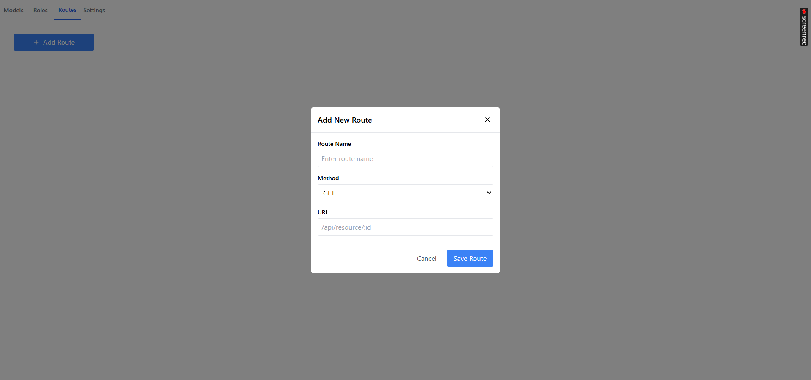
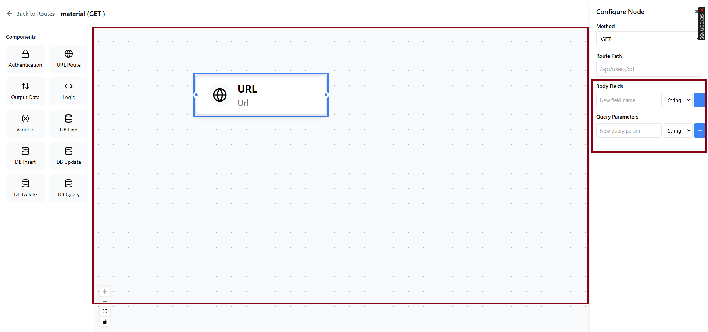
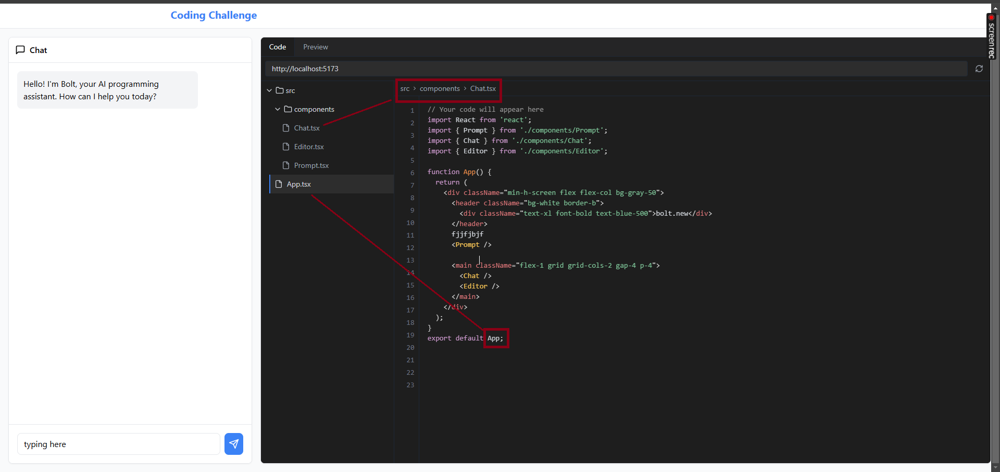
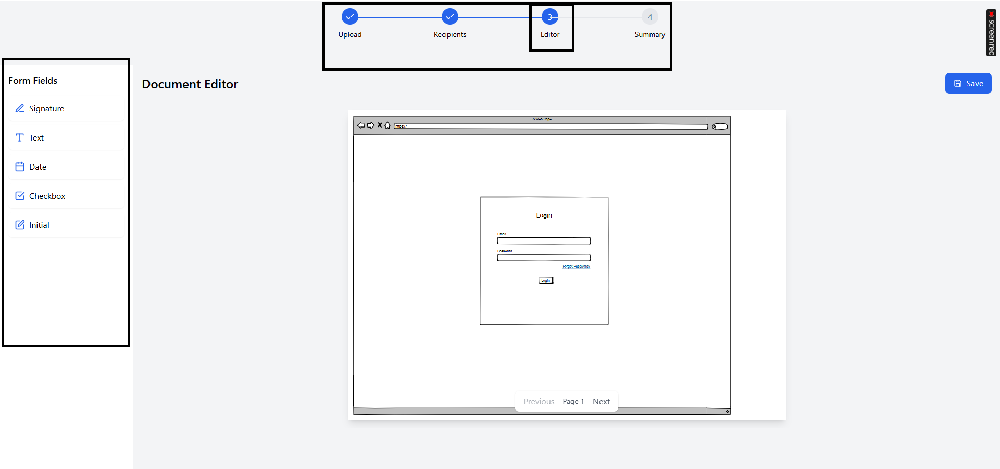

# This project is a toy project for training and quality assurance purposes

## Task

All this task must be done within 8 hours of working time

- go into folder task_1 and setup the project
- click route and add a new route
  > see screenshot 
- click the <> icon and see the editor for the route
  > see screenshot 
- click on URL component in the editor, the right side bar will pop up
  > see screenshot 
- try typing into Body Field new field input, nothing happens. Fix it.
  > see screenshot 
- once we type into the input, click the plus icon, we will see a gray area below the label Body Field stating the fields : type.
- try typing into Query Field new field input, nothing happens. Fix it.
  > see screenshot 
- once we type into the input, click the plus icon, we will see a gray area below the label Query Field stating the fields : type.
- Switch the state system from zustand to react Context API
- when you click "Back to Routes" and click on <> again, the state is lost, meaning all edits made are lost, fix it.

- open task_2 and setup the project
- type anything into the textarea, click generate.
- type typing into the code editor and you will see the cursor not aligned with what your typing, fix it.,
  > the text needs to appear in the same line as your cursor. see screenshots 
- when I click the files in the code editor on sidebar, nothing happens. Fix it.

  > you need to load the content of the file into the editor. see screenshots 

- open task_3 and setup the project
- when I upload a PDF file, I dont see a file attached below the dotted box. Fix it.
  > see screenshots 
- the lines are overlapping the circles in the wizard steps. Fix it.
  > see screenshots 
- On editor page, when I drag over any of form fields, I don't see them on the document. Fix it. I should be able to edit text there.
  > see screenshots 
- When I click save, I see table of my document. If I click send icon, I should see document preview with the input fields on same spot as I edited it. Fix it.

  > see screenshots 

- go into task_4 and run docker-compose up --build, the api will now run on localhost:3000
- Make a dashboard page like figma file https://www.figma.com/file/veiESwD61KJBa7BpEHtbdl/react-task-2?node-id=1086%3A15525
- Call paginate api as shown below to get video data. Show 10 per page. Have a next button at bottom when clicked, load next 10 videos

```
URL: http://localhost:3000/v1/api/rest/video/PAGINATE
METHOD: POST
BODY: {
    "page": 1,
    "limit": 10
}
Response:
{
    "error": false,
    "list": [
        {
            "id": 1,
            "title": "Rune raises $100,000 for marketing through NFT butterflies sale",
            "photo": "https://picsum.photos/200/200",
            "user_id": 1,
            "created_at": "2024-12-09T09:40:08.000Z",
            "updated_at": "2024-12-09T09:40:08.000Z",
            "likes": 10
        }
    ],
    "page": 1,
    "limit": 50,
    "total": 81,
    "num_pages": 2
}
```

- Call paginate api as shown below to get video data. Show 10 per page. Have a prev button at bottom when clicked, load prev 10 videos
- Use React Drag and drop library https://react-dnd.github.io/react-dnd/about to be able to rearrange the rows and columns in the table in dashboard. On Refresh, the columns go back to default
